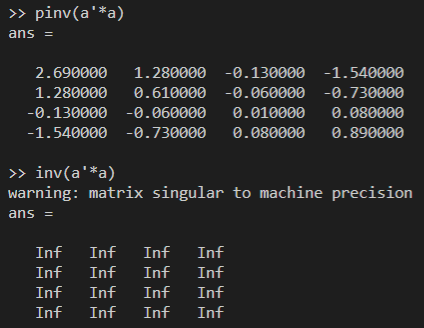

# week 3

[TOC]

## Logistic regression

线性回归无法很好的解决二分类，Logistic实际上是一种分类算法，输出不会像线性那样溢出（课程主要研究二值分类）

### 1 假设表示

sigmoid/logistic函数 $g(z)={1\over{1+e^{-z}}}$ 

拟合$\theta$ 

输出表示输入样本分类为1的可能性

$h_\theta(x) = P(y=1\vert x;\theta) $给定x的条件下y=1的可能性

==**为什么要用sigmoid函数呢？**==

二分类问题显然符合n重伯努利分布？

后验概率形式

指数族分布

对数几率（在试图寻找指数的关系的情况下，正例的可能性与反例的可能性之比的对数）->使用对数处理，线性拟合指数关系

实际情况中多数还是指数关系

容易求导

### 2  决策边界(decision boundary)

分界线

### 3 代价函数

直接使用sigmoid函数，函数图像上来看会有很多的局部最优解（非凸）

### 4 简化的代价函数与梯度下降

1.$Cost(h_\theta(x),y)=-y\log{(h_\theta(x))}-{(1-y)\log(1-h_\theta(x))}$

最大似然估计法从统计中获得，统计  对数似然函数

2.最小化代价函数->梯度下降

 ### 5 高级优化

代价函数和梯度->共轭梯度法(Conjugate gradient)/BFGS(变尺度法)/L-BFGS(受限变尺度法)->线性搜索算法计算学习率/收敛快

[jVal,gradient]<-(theta)   ->  fminunc

### 6 多分类问题

一对多算法？

多分类转化为二分类问题（训练集）

多个分类器，取最大值

## 过拟合问题

### 1 何为过拟合

变量过多

过于迎合训练集

解决方法：

1.减少变量（人工，算法）

2.正则化（保留所有变量，改变$\theta$大小）

### 2 代价函数

简化假设，在代价函数中惩罚某些变量

添加  
$$
\lambda\sum_{j=1}^n{\theta_j}^2
$$
项（未惩罚$\theta_0$）->正则化项   $\lambda$为正则化参数

使得能较好拟合训练集而且保持假设形式简单

L2正则化  相对于加Gauss分布先验

ps：当$\lambda$过大时，会造成欠拟合；太小就会造成过拟合

### 3 正则化线性回归

梯度下降

正规方程

不可逆  $m< n$时$X^\mathrm{T}X$ 不可逆\奇异\退化

而加入正则项可逆

### 4 正则化Logistic回归

正则项
$$
\lambda\sum_{j=1}^n{\theta_j}^2
$$
